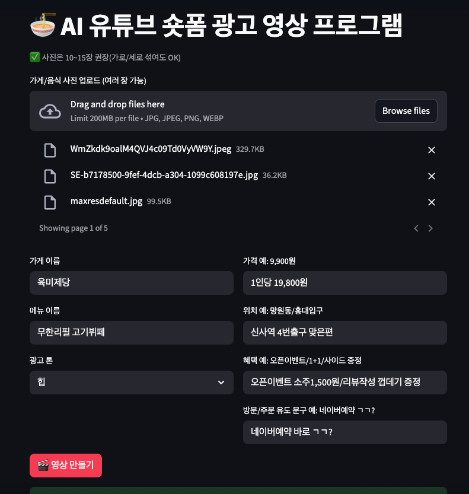
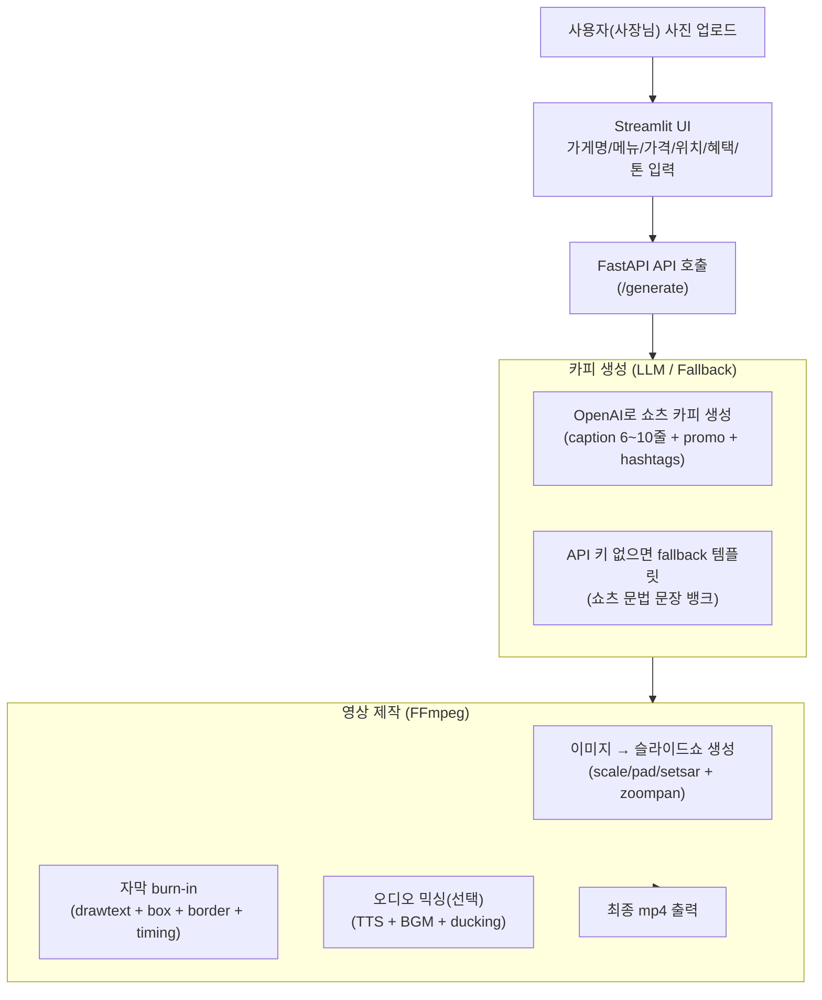

✅ [데모 결과물 클릭](https://vimeo.com/1159512235?share=copy&fl=sv&fe=ci)




# 🎬 AI 유튜브 숏폼 광고영상 제작 프로그램 (MVP)

---

소상공인(특히 오프라인 외식업)이 온라인 홍보로 전환할 때 필요한 광고 콘텐츠 제작 부담을 줄이기 위한 프로젝트입니다.
사장님이 찍은 음식/매장 사진 여러 장만 업로드하면,
생성모델이 쇼츠 문법에 맞춘 자막/카피를 만들고, 9:16(1080×1920) 유튜브·인스타 릴스용 광고 영상을 자동으로 생성합니다.

- ✅ 입력: 음식/매장 사진 10~15장(권장)
- ✅ 출력: 12~18초 광고용 mp4 (자막 burn-in 포함)
- ✅ 자막: LLM(OpenAI)로 “쇼츠 문법” 캡션 생성 + drawtext로 영상에 삽입
- ✅ 효과: 컷마다 줌/팬(zoompan) 모션으로 지루함 줄이기
- ✅ 오디오(선택): TTS + BGM 믹싱(덕킹) 가능

---

## 🧩 전체 파이프라인 로드맵


---

## 📌 핵심 포인트 
1. “영상”은 FFmpeg로 만든다
- moviepy도 가능하지만 실제 서비스에서는 속도 / 안정성 / 호환성 면에서 FFmpeg가 훨씬 강함
- 그래서 FFmpeg 커맨드를 조립해서 실행하는 구조로 설계했습니다.

2. 자막은 libass 대신 drawtext를 기본으로
- 환경/폰트/서버에 따라 libass가 깨지는 경우가 있어서, 항상 동작하는 drawtext로 burn-in 했습니다.

3) 쇼츠 문법(훅→감각→장점→정보→CTA)을 “구조”로 강제
- LLM이 있어도 매번 품질이 흔들릴 수 있으니, 프롬프트에 전개 구조를 강제하고 fallback도 “문장 뱅크 + 랜덤”으로 단조로움을 줄였습니다.

---

## 🖥️ 실행 방법 (로컬)

1) 환경 준비
- Python 3.9+ 권장
- ffmpeg 설치 필요
```bash
brew install ffmpeg
```

2) 설치
```bash
python -m venv .venv
source .venv/bin/activate

pip install -r requirements.txt
```

3) .env 설정
- OpenAI를 쓰면 카피 품질이 좋아집니다.
```bash
OPENAI_API_KEY=YOUR_KEY

VIDEO_SECONDS=15
VIDEO_SEGMENTS=6
VIDEO_SIZE=1080x1920
```

4) 서버 실행
```bash
# FastAPI
uvicorn backend.app.main:app --reload --port 8000

# Streamlit (프로젝트 구조에 맞게)
streamlit run frontend/app.py
```

---

## 🎥 영상 생성 흐름(코드 관점)

1) build_slideshow (이미지 → 무음 슬라이드쇼)
- 여러 장의 이미지를 9:16으로 맞춤(scale/pad/setsar)
- zoompan으로 컷마다 “줌인/줌아웃/팬” 변주

2) burn_text_overlays (자막을 영상에 직접 넣기)
- drawtext + border + shadow + box로 가독성 강화
- timings 기반으로 구간별 자막 표시

3) mix_audio (선택)
- voice(TTS) + bgm을 합치고
- voice가 나오는 동안 bgm이 자동으로 내려가게(sidechaincompress) 덕킹 적용

---

##🧠 LLM 출력 형식

caption_lines
- 쇼츠 자막용 6~10줄 (짧고 리듬감 있게)

promo_text
- 인스타/유튜브 설명란용 3~5문장
- hashtags: 5~12개

---

## 🎛️ 추천 설정 (실사용 감각)

- 사진: 10~15장
- 영상 길이: 18초
- 자막 줄 수: 8~10줄
- 이유: 18초에 6줄이면 “컷 템포가 느려서” 덜 쇼츠 같고,
- 8~10줄이면 “2초 전후 템포”로 더 쇼츠 느낌이 납니다.

---

## ⚠️ 트러블슈팅 메모

1) zoompan 에러 (Undefined constant / missing '(')
- zoompan 필터 문자열에서 d=... 같은 파라미터 조합이 깨지면 발생
- 해결: zoompan 문자열을 “필터 전체”로 반환하기보다, zoompan=...:d=...:s=...:fps=... 형태가 정확히 이어지도록 구성해야 합니다.

2) WEBP Exif 경고 (invalid TIFF header)
- 일부 WEBP에 Exif가 깨져있는 경우 뜨는 경고
- 대체로 치명적이진 않지만, 안정성을 위해 JPG/PNG로 변환하거나 pillow로 리세이브하는 전처리를 둘 수 있습니다.
